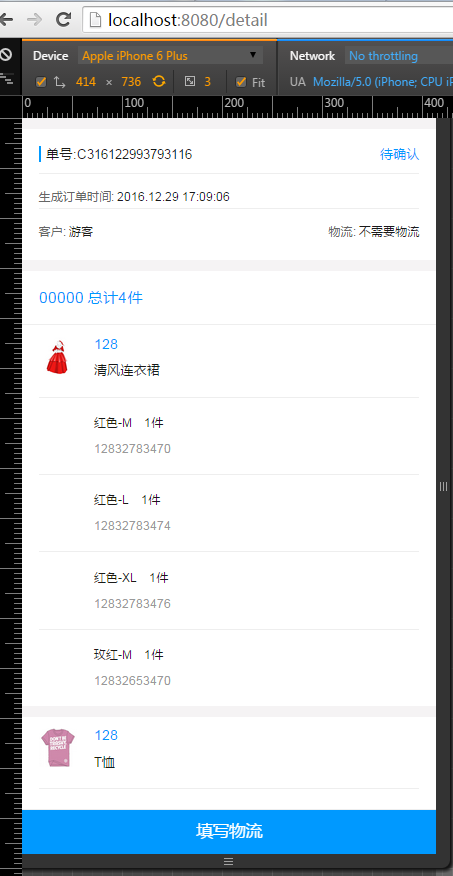
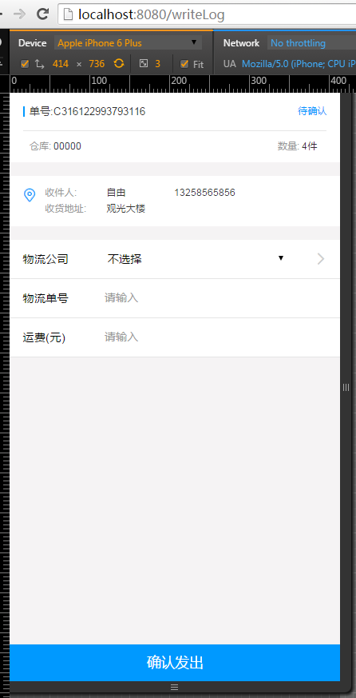

# React+React-router实战练习
仓库：[https://github.com/ipoto/react-demo-one.git](https://github.com/ipoto/react-demo-one.git)

## 参考资料
React.js文档：[http://uprogrammer.cn/react-tutorial-cn/index.html](http://uprogrammer.cn/react-tutorial-cn/index.html)

React-router文档：[http://www.uprogrammer.cn/react-router-cn/index.html](http://www.uprogrammer.cn/react-router-cn/index.html)

数据模拟请求Mockjs：[http://mockjs.com/](http://mockjs.com/)

##界面预览






> ps：demo只是模拟了工作上用过的几个页面，用以熟悉一些简单的React知识，数据都是为了页面结构的完整性模拟出来的

## Build

```bash
# install
npm install

# server
npm run dev

# build
npm run build
```
